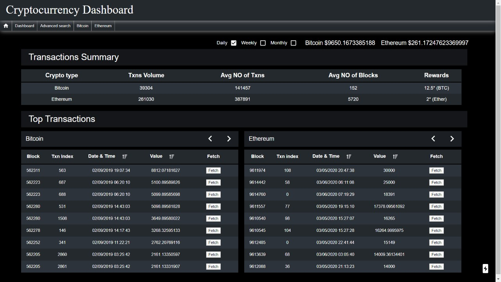

# block-explorer
block explorer built using React JS as client and Node JS as server

## **Prerequisites**

1. Nodejs 10.x.x
    
## **Installation**

First ensure you are in a new and empty directory.

1. Clone the repository

```
git clone https://github.com/varuntejay/block-explorer
```

2. Change the directory to the server and install node modules

```
cd ./server
npm install
```

3. Change the directory to the client and install node modules

```
cd ./client
npm install
```

## **Configuration**

In progress

## **Run node express back end server**

1. First, ensure that you're in the block-explorer/server folder.

2. Run the node express back end server in dev mode. This will up bring the express server on PORT 9086.

```
npm start
```
3. Make a test get call to express server. This will return "Hello from server".

```
http://<ip>:9086
```

## **Run react front end application**

1. First, ensure that you're in the block-explorer/client folder.

2. Build UI application using following command

```
npm run build
```

3. Run the web application in dev mode. This will up bring the react front end application on PORT 4000.

```
npm run start
```

4. Check out to the following URL to access the web application.

```
http://<ip>:3000
```

## Dashboard



